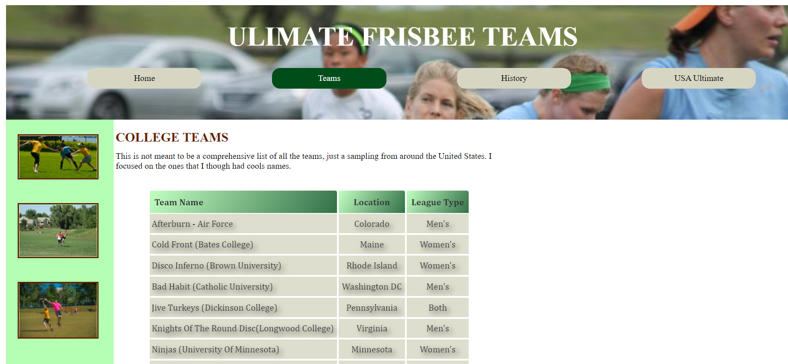

# Build a webpage with floats

This is a solution to the [https://quirky-austin-45ff3b.netlify.appl](https://quirky-austin-45ff3b.netlify.app/).
This is part of Web Design for Everybody: Basics of Web Development & Coding Specialization : Introduction to CSS3: homework.

## Table of contents

- [Overview](#overview)
  - [Screenshot](#screenshot)
  - [Links](#links)
- [My process](#my-process)
  - [Built with](#built-with)
  - [What I learned](#what-i-learned)
  - [Continued development](#continued-development)
- [Author](#author)

## Overview

This project should have:

- Connected diffrent html files on one webpage
- photos with border to be on the left side
- make table with contents and do style
- opacity in the picture and on the text in the table

### Screenshot



### Links

- Solution URL: [https://github.com/Holllyyyy/frizbi](https://github.com/Holllyyyy/frizbi)
- Live Site URL: [https://quirky-austin-45ff3b.netlify.app/](https://quirky-austin-45ff3b.netlify.app/)

## My process

I started with writing HTML5 where I added nav-bar with links of different html files.
In this three html files , in each one I have class="active".

```html
<nav>
  <a href="index.html" class="active">Home</a>
  <a href="teams.html">Teams</a>
  <a href="history.html">History</a>
  <a href="http://www.usaultimate.org/index.html" target="_blank"
    >USA Ultimate</a
  >
</nav>
```

In my CSS3 I done like this:

```css
.active {
  color: #ffffff;
  background-color: #004d1a;
}
```

So it will show up to user where is now, on which link, buy showin different color.

```css
section {
  display: inline-block;
}

.left {
  margin: 0 auto;
  padding: 2px;
  box-sizing: border-box;
  background-color: #b3ffb3;
  display: inline-block;
  height: 600px;
  width: 200px;
  float: left;
}

.right {
  width: 470px;
  height: 55px;
  margin: 14px;
  display: inline-block;
  float: left;
}
```

This is where is used float left, with display inline-block, so all elements will be in one line with float, and also some height and width and margin what will make sections to be beside each other. Its not so good practice, cause nowadays we have CSS grid and flex width what we can make it much more responsive and without issues. But sometimes is good to use floats as well.

Table is the last step here. It contains of table head element (th) and table data cells (td).
First table is centered with margins,line-heigt.
Table head element I added border, background where I used linear-gradient,border bottom thick.
Table data cells where I put border spacing 0,some padding and text shadow. I needed to use pseudo elements for alinging just few elements so it will look good.
It was really hard to center picture inside border on the left side , but I manage it with margins.

```css
table {
  border-spacing: 0;
  border: 2px solid #ffffff;
  color: #000000;
  margin: 10px 50px 50px 50px;
  font-size: 17px;
  line-height: 25px;
  width: 600px;
  font-family: Cambria, Cochin, Georgia, Times, "Times New Roman", serif;
}
th {
  border: 2px solid #ffffff;
  background: linear-gradient(120deg, #b3ffb3, #004d1a);
  -webkit-background-linear-gradient: (120deg, #b3ffb3, #004d1a);
  -o-background-linear-gradient: (120deg, #b3ffb3, #004d1a);
  -moz-background-linear-gradient: (120deg, #b3ffb3, #004d1a);
  border-bottom: thick;
  border-top-left-radius: 5px;
  border-top-right-radius: 5px;
  text-transform: capitalize;
  padding: 8px;
}
td {
  border: 2px solid #ffffff;
  border-spacing: 0;
  background-color: #d6d6c2;
  color: #000000;
  text-align: center;
  padding: 5px;
  border-radius: 2px;
  -webkit-border-radius: 2px;
  text-shadow: 5px 5px 10px rgb(26, 27, 26);
  text-transform: capitalize;
}

td:first-child {
  text-align: left;
  padding: 3px;
}
th:first-child {
  text-align: left;
}
tr {
  opacity: 0.8;
}
tr:hover {
  opacity: 1;
}
```

### Built with

- Semantic HTML5 markup
- CSS custom properties

### What I learned

While working on this project I learned :

- how to make nav bar and content of webpage using display inline-block
- how to connect in the nav bar diffrent html files
- how to organize main folder
- how to use floats
- how to make table with contents
- how to use text shadow

### Continued development

I will continue next with a course from Coursera. I want to practice and improve my HTML5 and CSS3 skills and learn about Java Script and Responsive Design.

## Author

- Website - [Svetlana Jokic](https://my-portfolio-hollyy.netlify.app/)
- Frontend Mentor - [@Holllyyyy](https://www.frontendmentor.io/profile/Holllyyyy)
- Twitter - [@svetlanajokic](https://twitter.com/svetlanajokic)
- LinkedIn - [@Svetlana Jokic](https://www.linkedin.com/in/svetlana-jokic-787432100/)
- FreeCodeCamp - [@hollyy](https://www.freecodecamp.org/hollyy)
